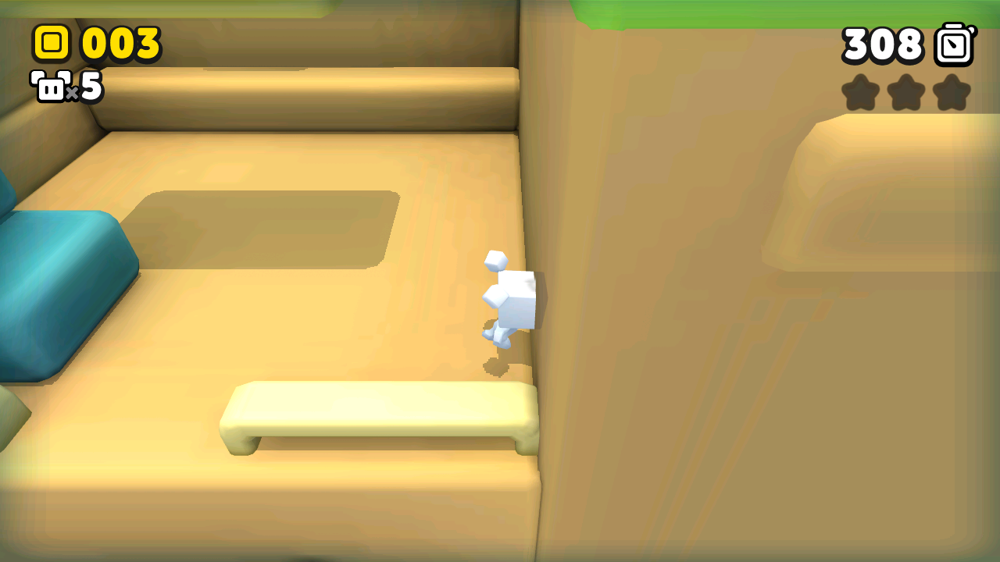
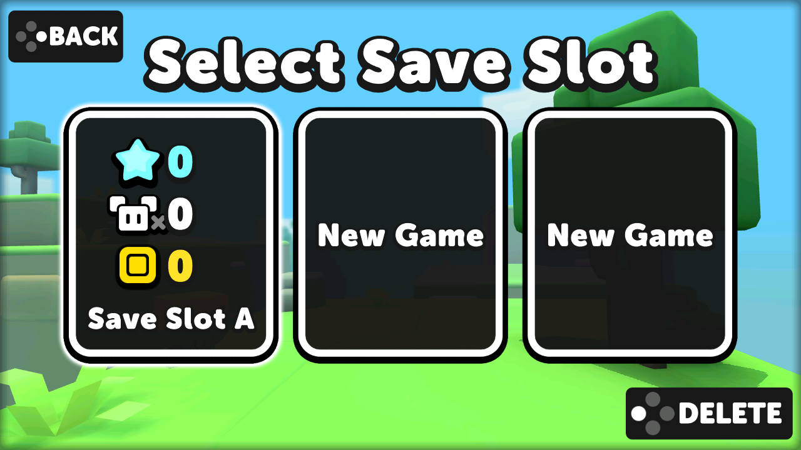

# Suzy Cube — universal AArch64 Unity/IL2CPP port

**Language / Idioma:** [English](#english) · [Português](#português)

This project is an independent compatibility loader. It does not distribute
Suzy Cube's APK, Unity/IL2CPP libraries, art, music or any other proprietary
game data.

[Download the latest PortMaster package / Baixar o pacote PortMaster](https://github.com/NextOs-Ports/suzycube-nextos/releases/latest)

## Community

Questions, bug reports, help getting the port running, and news about the next ones:

💬 **Discord:** [discord.gg/DHfY62eDNN](https://discord.gg/DHfY62eDNN)

## English

### Status

Suzy Cube (Noodlecake / Louard Fischer, Unity 2017.4.40f1 IL2CPP arm64) runs
through its native Unity flow. One universal AArch64 loader — built against
glibc 2.28 with an effective floor of `GLIBC_2.27` and ceiling `GLIBC_2.30` —
runs unchanged on NextOS and on PortMaster firmwares such as ArkOS/R36S, with
no per-device build.

| Physical target | Display / GPU | Validated result |
|---|---|---|
| ArkOS / R36S (RG351MP) | Mali-G31, KMSDRM, glibc 2.30 | 59.7 fps at 640×480, ALSA audio |
| NextOS Amlogic-old | Mali-450 Utgard, fbdev | 55–56 fps at 1280×720, PulseAudio |
| NextOS X5M | Mali-G310 Valhall, KMSDRM | 59.7 fps at 1920×1080, ALSA audio |

There is no Android and no emulator in the path: the loader maps the original
arm64 objects (`libmain.so`, `libunity.so`, `libil2cpp.so`), runs their real
`init_array` and `JNI_OnLoad`, and drives the native UnityPlayer lifecycle
(`initJni` → `nativeRecreateGfxState` → `nativeResume` → `nativeRender`).

- Video: resolution is read from the device, never hardcoded.
- Audio: Unity's internal FMOD at 24000 Hz stereo, output through the system SDL.
- Controls: factory InControl — the physical pad is delivered as a real
  `InputDevice`; SDL provides mapped analog values and `evdev` validates
  capabilities and snapshots digital buttons. No cursor, no synthetic touch.
  Pads without physical SELECT/START (RK3326 family) map
  `BTN_TRIGGER_HAPPY1/2` directly.
- Save: `PlayerPrefs` in `home/shared-preferences.bin`, survives close/reopen.
- Textures: the game's own ETC1; residual ETC2 is decoded in software when the
  driver lacks it.
- Shaders: a GLES2 variant ships in the game data; no ES3→ES2 shim.

### Controls

| Button | Action |
|---|---|
| D-pad / left stick | move, navigate menus |
| A / Cross (south button) | jump / confirm |
| B / Circle (right button) | back / cancel |
| Other face buttons | actions shown by the game |
| L1 / R1 | switch worlds on the map |
| START | start / pause |
| SELECT + START | quit through the native path (pause + save + exit) |

Since v1.1.11, `SC_FACE_LAYOUT=auto` is the default. A normal Xbox controller
is left unchanged; when SDL plus `evdev` prove a Nintendo-labelled layout, the
port normalizes it to the positions shown by the game: A/Cross on the south
button and B/Circle on the right button. This behavior was physically confirmed
on dArkOSRE with the GO-Super Gamepad. `SC_FACE_LAYOUT=firmware` preserves the
CFW's published letters, while `SC_FACE_LAYOUT=xbox` forces Xbox positions when
an unambiguous `evdev` snapshot is available.

Version 1.1.10 keeps `evdev` only to verify that a mapped physical axis is
genuinely analog, while taking its value from SDL's calibrated mapped output.
This preserves firmware inversion, half-axis and scaling rules and fixes a
lower-left diagonal arriving as a half press. The existing radial 0.40/0.30
hysteresis, trigger handling and neutral focus/hotplug sample remain unchanged.

### Installation

See [`INSTALLATION.md`](INSTALLATION.md). In short: extract the release ZIP
over your firmware's `ports` folder, place your own legally obtained APK in
`suzycube/gamedata/`, and launch once — the installer (NXExtract) does the
rest. The launcher is clean, PortMaster-style: it never stops or restarts
EmulationStation.

### Diagnostics

All off by default; the shipped binary is silent. `SC_VERBOSE`, `SC_LOGCAT`,
`SC_JNILOG`, `SC_FPS`, `SC_FRAMES`, `SC_AUDIO_TRACE`, `SC_INPUTLOG`,
`SC_FACE_LAYOUT` and `SC_SCREENSHOT` are documented in
[`docs`](INSTALLATION.md) and in the loader source under [`src/`](src/).

## Português

### Estado

O Suzy Cube (Noodlecake / Louard Fischer, Unity 2017.4.40f1 IL2CPP arm64) roda
pelo fluxo nativo da Unity. Um único loader AArch64 universal — compilado
contra glibc 2.28, com piso efetivo `GLIBC_2.27` e teto `GLIBC_2.30` — roda
sem alteração no NextOS e em firmwares PortMaster como ArkOS/R36S, sem build
por aparelho.

| Aparelho | GPU | Resultado validado |
|---|---|---|
| ArkOS / R36S (RG351MP) | Mali-G31, KMSDRM, glibc 2.30 | 59,7 fps a 640×480, áudio ALSA |
| NextOS Amlogic-old | Mali-450 Utgard, fbdev | 55–56 fps a 1280×720, PulseAudio |
| NextOS X5M | Mali-G310 Valhall, KMSDRM | 59,7 fps a 1920×1080, áudio ALSA |

Não há Android nem emulador no caminho: o loader mapeia os objetos arm64
originais (`libmain.so`, `libunity.so`, `libil2cpp.so`), roda os `init_array`
e `JNI_OnLoad` de verdade e dirige o ciclo de vida nativo do UnityPlayer.

- Vídeo: resolução lida do aparelho, nunca cravada.
- Áudio: FMOD interno da Unity a 24000 Hz estéreo, saída pelo SDL do sistema.
- Controle: InControl de fábrica — pad físico como `InputDevice` real; SDL
  fornece os valores analógicos mapeados e o `evdev` valida capacidades e faz
  snapshots dos botões digitais. Sem cursor, sem toque sintético. Pads sem
  SELECT/START físicos (família RK3326) usam `BTN_TRIGGER_HAPPY1/2`.
- Save: `PlayerPrefs` em `home/shared-preferences.bin`, sobrevive a fechar e
  reabrir.
- Texturas: ETC1 do próprio jogo; ETC2 residual decodificado em software
  quando o driver não o tem.
- Shaders: variante GLES2 presente nos dados; sem shim ES3→ES2.

### Controles

| Botão | Ação |
|---|---|
| D-pad / analógico esquerdo | mover, navegar nos menus |
| A / Cross (botão sul) | pular / confirmar |
| B / Circle (botão à direita) | voltar / cancelar |
| Demais botões de face | ações indicadas pelo jogo |
| L1 / R1 | trocar de mundo no mapa |
| START | começar / pausar |
| SELECT + START | sair pelo caminho nativo (pause + save + fim) |

Desde a v1.1.11, `SC_FACE_LAYOUT=auto` é o padrão. Um controle Xbox permanece
inalterado; quando SDL + `evdev` comprovam letras Nintendo, o port normaliza as
posições para o padrão mostrado pelo jogo: A/Cross no botão sul e B/Circle no
botão à direita. Esse comportamento foi confirmado fisicamente no dArkOSRE com
o GO-Super Gamepad. `SC_FACE_LAYOUT=firmware` preserva as letras publicadas pelo
CFW e `SC_FACE_LAYOUT=xbox` força posições Xbox quando o snapshot é inequívoco.

Na v1.1.10, o `evdev` apenas confirma que o eixo físico mapeado é realmente
analógico; o valor vem da saída calibrada e mapeada do SDL. Isso preserva
inversão, meia-faixa e escala definidas pelo firmware e corrige a diagonal
inferior-esquerda que chegava como meia pressão. A deadzone radial 0,40/0,30,
os gatilhos e a neutralização em foco/hotplug permanecem inalterados.

### Instalação

Ver [`INSTALLATION.md`](INSTALLATION.md). Em resumo: extrair o ZIP da release
sobre a pasta `ports` do firmware, colocar o seu APK obtido legalmente em
`suzycube/gamedata/` e abrir uma vez — o instalador (NXExtract) faz o resto.
O launcher é limpo, padrão PortMaster: ele **nunca** para nem religa o
EmulationStation.

## License

The loader and support code in this repository are released under the
[GPL-3.0](LICENSE). Third-party notices are in [`NOTICE.md`](NOTICE.md) and
[`licenses/`](licenses/). No proprietary game data is included — you provide
your own copy of the game.
